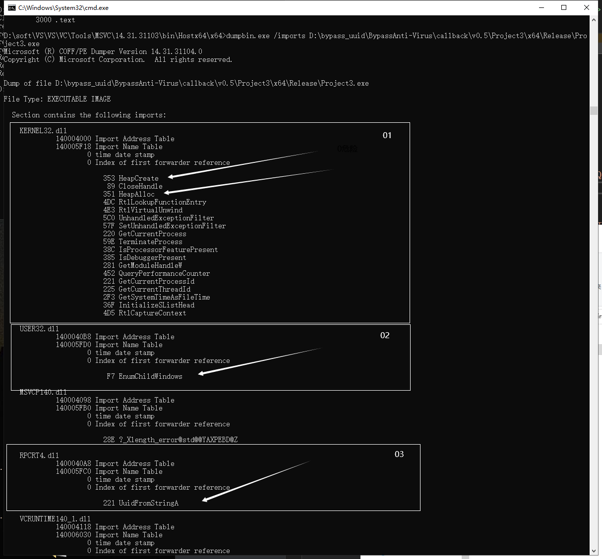
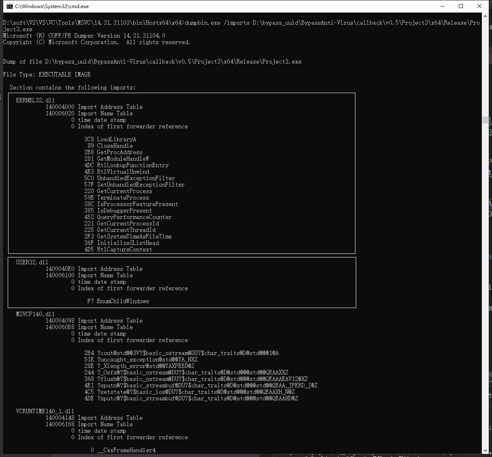

# 免杀方式：隐藏导入表


在今年上半年，我们介绍通过[其他形式shellcode的转换+系统回调函数的方式](https://github.com/midisec/BypassAnti-Virus/tree/main/callback)来加载shellcode绕过杀毒软件，随着时间的推移，部分系统回调函数和创建内存的函数已经被列入黑名单中。杀毒软件可以通过计算PE文件的导入表（import address tables）的哈希值来判断该程序是否调用这些敏感函数，进而判断是否为危险程序，本文将介绍通过函数指针的方式调用系统函数，从而隐藏程序导入表。


## 导入表的查询：

### 工具：  

VS2022自带的dumpbin.exe (Path: [vs2022]\VC\Tools\MSVC\14.31.31103\bin\Hostx64\x64\dumpbin.exe) 或 PE查看工具

### 使用指南：

```bash
dumpbin.exe /imports Project3.exe
```


例如我们查看[回调函数V0.2版本](https://github.com/midisec/BypassAnti-Virus/tree/main/callback/v0.2)中的导入表



从中可以看出几个目前已经标记为敏感调用的函数，

**01**： KERNEL32.dll下用来创建、分配内存的HeapCreate、HeapAlloc；

**02**： USER32.dll下用来加载shellcode的回调函数EnumChildWindows；

**03**： RPCTR4.dll下用来shellcode转换的UuidFromStringA。

为了避免杀毒软件直接通过PE文件中的导入表进行查杀，我们使用函数指针动态加载这些系统函数。


## 实现方法

### 相关函数

#### Ⅰ. 获取/加载相关模块的句柄

GetModuleHandle(TEXT("kernel32.dll"))   :  获取kernel32模块，注意必须已由调用进程下模块加载（当前同一模块）

LoadLibraryA("RPCRT4.dll")  :  加载指定的RPCRT4模块，可以是其他模块

> 其中从上图的导入表中可以看出，USER32.dll和RPCRT4.dll中只调用单个函数（说明进程在调用这些函数时是单独加载的模块），也就是这个模块是需要单独指定加载的，因此只能使用LoadLibraryA而不能使用GetModuleHandle。

#### Ⅱ. 导出系统函数地址

GetProcAddress(模块的句柄, 函数名)  : 获取系统函数的地址，从而实现动态加载系统函数。

#### Ⅲ. 定义函数指针执行函数

在VS2022中可以通过"Ctrl+左边"的方式查看原先系统函数的定义，例如HeapCreate函数的定义为


因此我们可以直接复制并修改，定义一个函数指针ImportHeapCreate，其中的参数以及返回值可以参考上图。

```c++
typedef HANDLE(WINAPI* ImportHeapCreate)(
	_In_ DWORD flOptions,
	_In_ SIZE_T dwInitialSize,
	_In_ SIZE_T dwMaximumSize
	);
```

#### Ⅳ. 通过 Ⅰ和Ⅱ方法组合，动态获取系统函数地址+定义函数指针从而进行函数执行

以 HeapCreate、HeapAlloc、UuidFromStringA这三个函数为例

```c++
// 1. 先根据③中的方法，定义函数指针
typedef HANDLE(WINAPI* ImportHeapCreate)(
	_In_ DWORD flOptions,
	_In_ SIZE_T dwInitialSize,
	_In_ SIZE_T dwMaximumSize
	);

typedef LPVOID(WINAPI* ImportHeapAlloc)(
	_In_ HANDLE hHeap,
	_In_ DWORD dwFlags,
	_In_ SIZE_T dwBytes
	);

typedef RPC_STATUS(RPC_ENTRY* ImportUuidFromStringA)(
	_In_opt_ RPC_CSTR StringUuid,
	_Out_ UUID __RPC_FAR* Uuid
	);

// 2. 通过获取模块句柄（GetModuleHandle、LoadLibraryA），再通过GetProcAddress导出函数地址

int main()
{
	// 通过GetModuleHandle+GetProcAddress的方式
	ImportHeapCreate MyHeapCreate = (ImportHeapCreate)GetProcAddress(GetModuleHandle(TEXT("kernel32.dll")), "HeapCreate");
	ImportHeapAlloc MyHeapAlloc = (ImportHeapAlloc)GetProcAddress(GetModuleHandle(TEXT("kernel32.dll")), "HeapAlloc");

	// 通过LoadLibraryA+GetProcAddress的方式
	HMODULE hModule = LoadLibraryA("RPCRT4.dll");
	ImportUuidFromStringA MyUuidFromStringA = (ImportUuidFromStringA)GetProcAddress(hModule, "UuidFromStringA");
 	
    // ...
    // ...
    
    return 0;
}
	
```

这样一来，我们就将 HeapCreate、HeapAlloc、UuidFromStringA这三个系统函数通过地址并利用函数指针动态调用，并取名为MyHeapCreate、MyHeapAlloc、MyUuidFromStringA。在完整的代码编译后，我们再查询下导入表。（此时在导入表中已经隐藏了HeapCreate、HeapAlloc、UuidFromStringA）




与此同时，由于时间的推移，我们将之前回调函数中的所有版本进行隐藏导入表的操作，并通过VT查杀的结果，实验对比出具体存在敏感的函数。

## 目录

| 版本号 | 写入内存方式                                    | VT查杀率 | 时间       | 火绒 | 360  | 腾讯 | 代码 |
| ------ | ----------------------------------------------- | -------- | ---------- | ---- | ---- | ---- | ---- |
| 0.1    | uuid转化(UuidFromStringA)+隐藏导入表            | 7/68     | 2022-07-10 | √    | √    | √    | c++  |
| 0.2    | base64+uuid转化(UuidFromStringA)+隐藏导入表     | 3/68     | 2022-07-10 | √    | √    | √    | c++  |
| 0.3    | ipv6转化(RtlIpv6StringToAddressA)+隐藏导入表    | 6/68     | 2022-07-10 | √    | √    | √    | c++  |
| 0.4    | mac转化(RtlEthernetStringToAddressA)+隐藏导入表 | 7/68     | 2022-07-10 | √    | √    | √    | c++  |
| 0.5    | ipv4转化(RtlIpv4StringToAddressA)+隐藏导入表    | 17/68    | 2022-07-10 | √    | √    | √    | c++  |


## 上手指南

 各个版本的[使用方法](https://github.com/midisec/BypassAnti-Virus/tree/main/callback#%E4%B8%8A%E6%89%8B%E6%8C%87%E5%8D%97)如同以往一致。


## VT查杀实验对比结果

①  HeapCreate、HeapAlloc与部分回调函数组合使用时，会被静态查杀到，可以通过隐藏导入表的方式绕过。

②  其中shellcode转换为IPV4（版本0.5），其ipv4数组的**前几个ip地址特征明显**且已经被大多数杀毒软件标记，所以该方法查杀率较高，可以通过**分离shellcode(**分离ipv4数组)的方式或其他编码的形式绕过检测。

③ 大部分回调函数没有被标记为敏感函数。


此外，隐藏导入表是一个综合的方法，可以使用在任何你想调用的系统函数当中，以函数指针执行动态获取地址的方式达到隐藏。


## 解决出现黑框情况

[VS中运行去除黑框](https://github.com/midisec/BypassAnti-Virus/blob/main/common/VS%E4%B8%AD%E8%BF%90%E8%A1%8C%E5%8E%BB%E9%99%A4%E9%BB%91%E6%A1%86.md)


## 参考

[https://idiotc4t.com/defense-evasion/avtive-call-api](https://idiotc4t.com/defense-evasion/avtive-call-api)

[https://luckyfuture.top/BypassAVLearning4](https://luckyfuture.top/BypassAVLearning4)

[https://docs.microsoft.com/en-us/windows/win32/api/libloaderapi/nf-libloaderapi-getmodulehandlea](https://docs.microsoft.com/en-us/windows/win32/api/libloaderapi/nf-libloaderapi-getmodulehandlea)

[https://docs.microsoft.com/en-us/windows/win32/api/libloaderapi/nf-libloaderapi-loadlibrarya](https://docs.microsoft.com/en-us/windows/win32/api/libloaderapi/nf-libloaderapi-loadlibrarya)